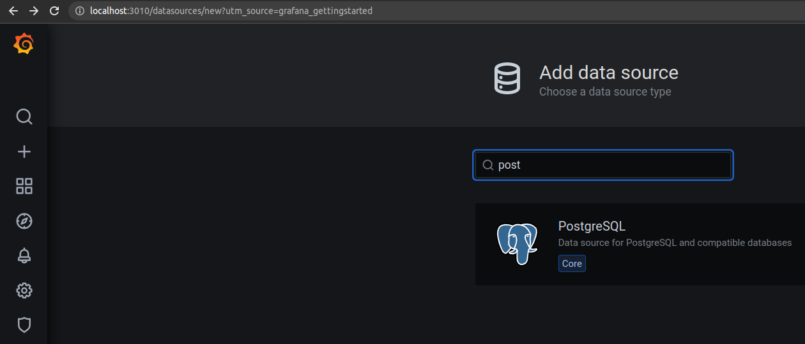
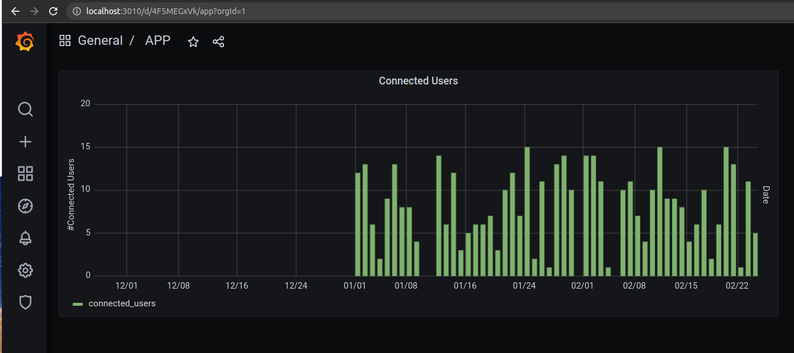

# database-visualizer-tool
This repo demonstrate how to use graphana to easily create dashboard in graphana with out redeveloping dashboard UI using angular/react etc

## 1. run docker-compose to setup the necessary services
```
docker compose up -d
```
## 2. Setup Postgres & Pgadmin (http://localhost:9001)
1. Test pgadmin connection to postgres 
```
psql -d dev -h localhost -p 5436 -U test   #-d specify database name
```
2. Add postgres server to pgadmin
3. Create tables and alter tables using code in db_create.sql
4. Import csv directly to table. Refer  https://belowthemalt.com/2021/06/10/import-data-from-local-to-postgresql-and-pgadmin4-running-on-docker/

## 3. Setup Graphana (http://localhost:3010/)


1. Add data source to Graphana
Use the below values to configure
```
Host : postgres:5432 # use name of service from docker-compose file
User: superset
Password : superset # database password from docker-compose file
SSL Mode: disable
```
2. Create dashboard
3. Add panel
4. Specify the sql query to plot the chart
```
SELECT
  $__time(datestamp), # specify time field
  connected_users
FROM
  connected_users
WHERE
  $__timeFilter(datestamp) # specify time field
```
# Graph added to graphana



# Reference
## Postgres
* https://www.postgresqltutorial.com/postgresql-tutorial/import-csv-file-into-posgresql-table/

## Graphana
* Embedd graphana as iframe inline frame in the browser 
https://grafana.com/docs/grafana/latest/dashboards/share-dashboards-panels/

